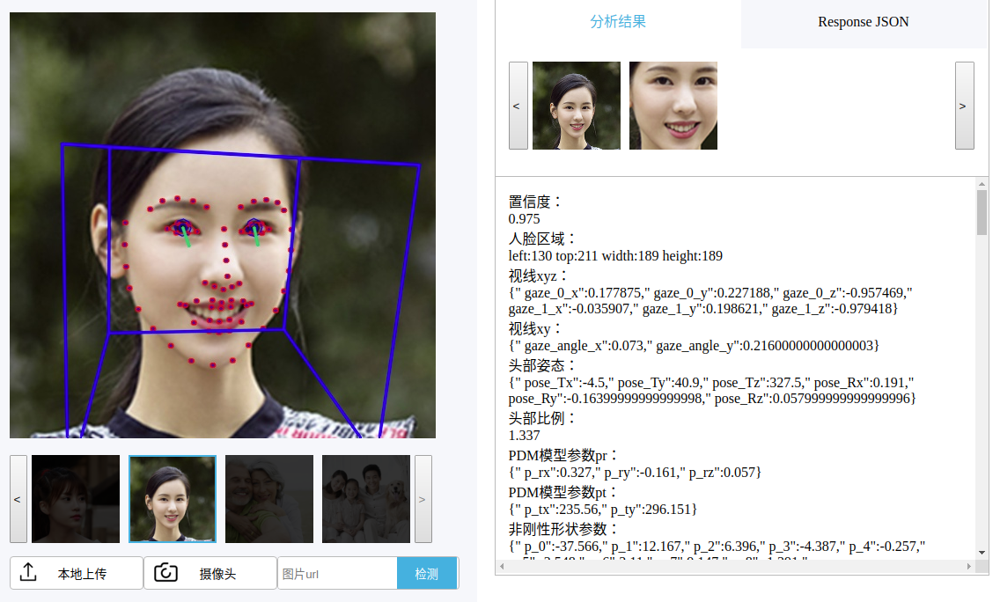
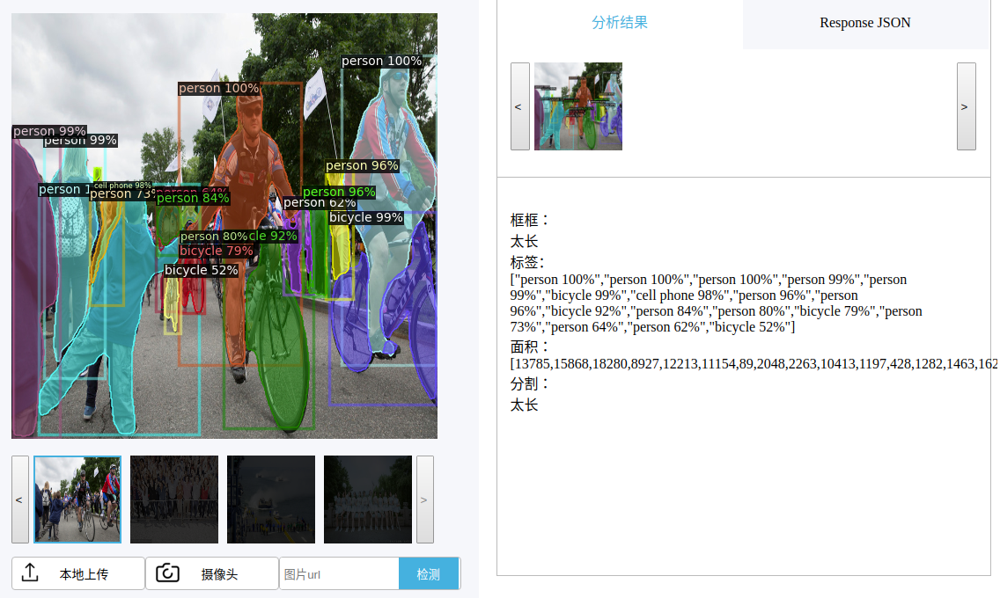
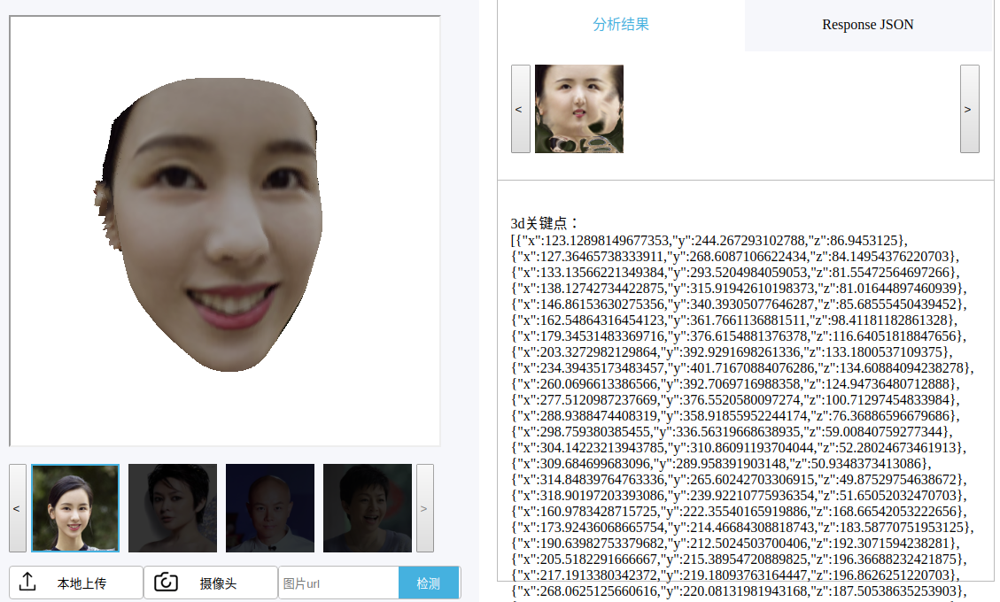

# 这是什么
收集各类深度学习项目,快速搭建demo.用最小代码量实现功能展现.  
分为cpu版本及gpu版本.模型仅能运行在gpu上,或是在cpu上体验差的模型会采用gpu版本.
推理方式按照从轻原则
* 小模型常驻内存cpu推理
* 大模型以docker容器推理,完成后销毁容器

[[部署]](https://pc.zzz9958123.com:5000) [[视频介绍]](https://youtu.be/qS3-gk3_UBI)

# 示例
<p align="center">关键点检测openface <br> </p>
<p align="center">分割检测detecron2 <br> </p>
<p align="center">人脸三维重建prnet <br> </p>

# 列表
| 项目名称 | 推理方式 | 设备 | 模型 | 来自
| :-: | :-: | :-: | :-: | :-:
| 人脸检测 | 常驻内存 | cpu | mtcnn | -
| 关键点检测 | 单次容器 | cpu | openface | [github](https://github.com/TadasBaltrusaitis/OpenFace)
| 人脸对齐 | 单次容器 | cpu | face-alignment | -
| 分割检测 | 单次容器 | gpu | detecron2 | [github](https://github.com/facebookresearch/detectron2)
| 分割检测 | 单次容器 | cpu | maskrcnn | [github](https://github.com/facebookresearch/maskrcnn-benchmark)
| 姿态检测 | 单次容器 | gpu | densepose | [github](https://github.com/facebookresearch/DensePose)
| 分割美妆 | 单次容器 | gpu | face-makeup.PyTorch | [github](https://github.com/zllrunning/face-makeup.PyTorch)
| 人脸属性预测 | 常驻内存 | cpu | attribute-predict | -
| 人脸校验 | 常驻内存 | cpu | arcface | [github](https://github.com/deepinsight/insightface)
| 人脸三维重建 | 单次容器 | cpu | prnet | [github](https://github.com/YadiraF/PRNet)
| 超分辨率 | 单次容器 | cpu | srgan | [github](https://github.com/brade31919/SRGAN-tensorflow)
| 智能美妆 | 常驻内存 | cpu | beautygan | [github](https://github.com/Honlan/BeautyGAN)
| 属性操纵 | 单次容器 | gpu | stylegan | [github](https://github.com/NVlabs/stylegan)
| 属性操纵 | 单次容器 | gpu | glow | [github](https://github.com/openai/glow)
| 人脸插值 | 单次容器 | gpu | glow | [github](https://github.com/openai/glow)
| 人脸插值 | 单次容器 | gpu | stylegan | [github](https://github.com/NVlabs/stylegan)
| 图像修复 | - | 浏览器 | - | [nvidia-playground](https://www.nvidia.com/en-us/research/ai-playground/)
| 智能画图 | - | 浏览器 | guagan | [nvidia-playground](https://www.nvidia.com/en-us/research/ai-playground/)
| 动物转换 | - | 浏览器 | gannimal | [nvidia-playground](https://www.nvidia.com/en-us/research/ai-playground/)
| tf-js | - | 浏览器 | - | [github](https://github.com/justadudewhohacks/face-api.js)


# 安装
* 主环境镜像
```
docker pull zzz9958123/demo_server
```
* 各项目镜像
```
docker pull zzz9958123/glow
docker pull zzz9958123/detectron2
docker pull zzz9958123/densepose
docker pull zzz9958123/openface
docker pull zzz9958123/densepose
docker pull zzz9958123/maskrcnn-benchmark
docker pull zzz9958123/prnet
docker pull zzz9958123/haircolour
docker pull zzz9958123/face_alignment
docker pull zzz9958123/srgan
```
* 下载模型放入model [[GD]](https://drive.google.com/drive/folders/1YV2B_WE5CtpFzokCTtM1rTFxB3ebRuY-?usp=sharing) [[baidu]](https://pan.baidu.com/s/1XAOyBFsvwKMAwt4sSEQ0TQ)

* 将cert和key证书文件放入ssl，不启用https的话摄像头获取图片实现不了，其他功能不影响。

# 运行
```
docker-compose up
```
访问 **http://0.0.0.0:5000** 查看导航页


# rest-api
所有项目均包含rest-api调用方法
url为项目地址
post请求提交form表单,输入{base64:图片base64},返回json计算结果.结构可参照demo页面Response JSON.

以python3为例

```
import requests
import base64
res = requests.post("https://pc.zzz9958123.com:5000/attribute_predict",data={"base64":b"data:img/png;base64,"+base64.b64encode(open("abc.png","rb").read())}).content
print(res)
```

# todo
项目的初衷是打造一个通用的深度学习推理平台，可用于 demo 展示，和类似百度 AI 推理平台的功能。现在 demo 展示的部分是完成了。但是推理平台还差了些意思，做了一些妥协只能用于 demo 了，因为显存不足以加载过多的模型，现在要每次加载后推理然后销毁。就导致了推理耗时增大很多还有并发量很低。 AI 推理平台应该是要另换一套架构去做，想到的几个点是：

*   榨干显卡性能，高并发
*   key，secret 机制
*   账号及充值方法
*   ....
